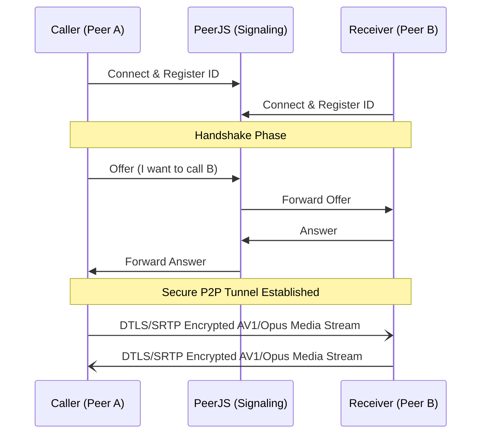

# Darpan 🪞

> *Darpan (Sanskrit: "Mirror") - A state-of-the-art, zero-latency, purely peer-to-peer WebRTC video calling application.*

Darpan is designed to provide the absolute highest mathematical fidelity for 1-on-1 video communication. By bypassing centralized Selective Forwarding Units (SFUs) used by enterprise tools (Zoom, Meet), Darpan achieves true end-to-end encryption and sub-50ms latency.

---

## 🚀 Key Features

* **Zero-Latency P2P Architecture**: Direct IP-to-IP tunnels via `RTCPeerConnection`.
* **State-of-the-Art AV1/VP9 Codecs**: Explicitly enforces next-generation video codecs via SDP parameter injection, guaranteeing vastly superior image quality over legacy VP8/H264 at identical bitrates.
* **Studio-Grade Audio**: Forces 48kHz Stereo Opus encoding alongside hardware-level Acoustic Echo Cancellation (AEC) and Noise Suppression.
* **WebGL GPU Post-Processing**: Offloads visual enhancements to the GPU. Darpan runs a real-time **3x3 Convolution Matrix (Unsharp Mask)** fragment shader alongside a contrast/gamma curve to artificially sharpen blurry webcams.
* **Live Telemetry**: Real-time polling of WebRTC network stats (Upload/Download Mbps) right in the UI.

---

## 📐 Architecture Overview

Darpan relies on **PeerJS** purely for initial STUN/TURN signaling (handshaking). Once the connection is established, the server is completely removed from the loop.



---

## 🛠️ Codebase Structure

The codebase is written in modern **TypeScript (v7)** with strict type safety and compiled to ES2022:

| Path | Purpose |
|------|---------|
| `src/app.ts` | **TypeScript Source of Truth**: WebRTC signaling, OpenRelay TURN relays, WebGL 3x3 Laplacian shader, hardware management, and telemetry. |
| `dist/app.js` | Compiled JavaScript runtime bundle for browser execution. |
| `index.html` | Minimalist layout featuring a responsive glassmorphic dock, anchored popovers, and draggable local preview. |
| `style.css` | Comprehensive design tokens, responsive single-row mobile dock pill, and glassmorphic styling. |
| `tsconfig.json` | Strict TypeScript compiler configuration (ES2022 target, declaration maps). |
| `tests/webrtc.spec.js` | Automated Playwright test suite validating handshakes, device enumeration, media toggles, and quality constraints. |

---

## 💻 Local Development & TypeScript Build

Because Darpan uses native browser APIs (`navigator.mediaDevices`), it **must** be served over `localhost` or a secure `https` context.

### Prerequisites
- [Node.js](https://nodejs.org) (v18+ recommended).

### Setup & Compilation
1. Clone the repository and install dependencies:
   ```bash
   git clone https://github.com/sagnikrout/Video_Call.git
   cd Video_Call
   npm install
   ```
2. Build the TypeScript source:
   ```bash
   npm run build
   ```
3. (Optional) Run TypeScript type checker or watch mode:
   ```bash
   npm run type-check   # Verifies strict typing with 0 emissions
   npm run watch        # Incremental compilation on save
   ```
4. Serve the directory locally:
   ```bash
   npx serve .
   ```
5. Open `http://localhost:3000` in your browser.

---

## 🧪 Testing

Darpan uses **Playwright** for headless E2E testing with simulated camera/microphone streams:

```bash
npm test
```

---

## 📜 License
MIT License - Free to use, modify, and deploy.
