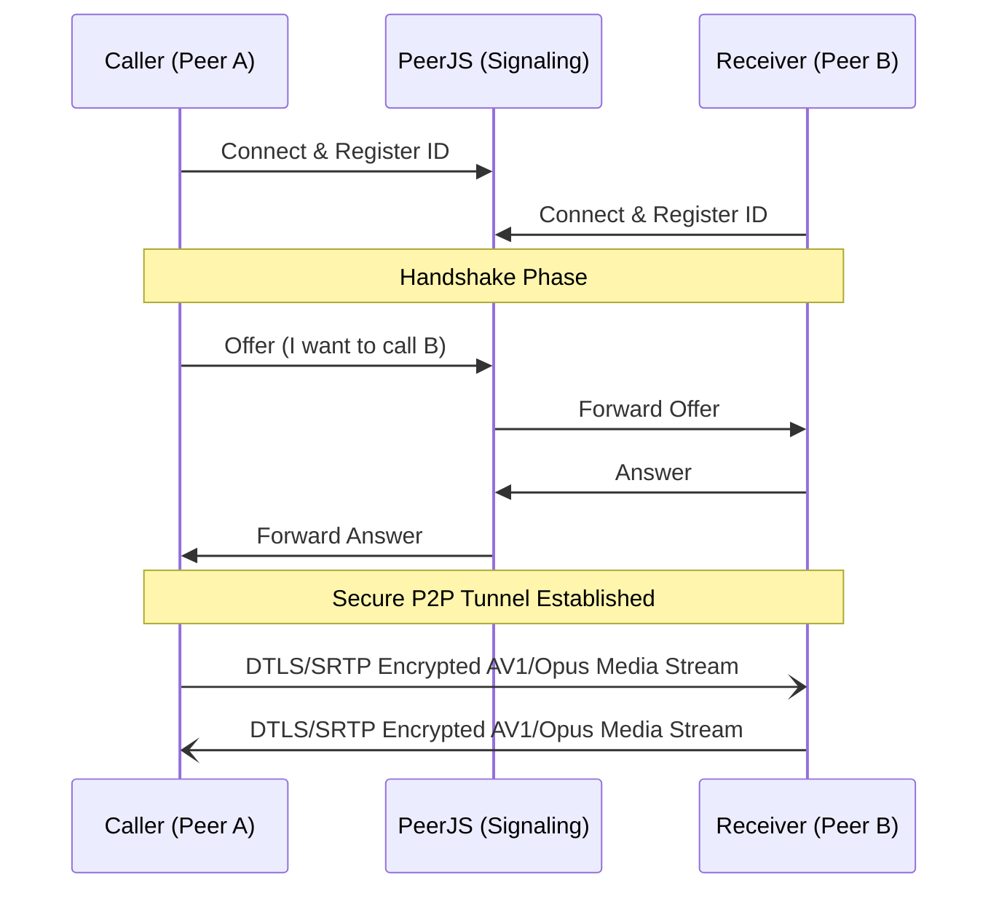

# Darpan 🪞

> *Darpan (Sanskrit: "Mirror") - A state-of-the-art, zero-latency, purely peer-to-peer WebRTC video calling application.*

Darpan is designed to provide the absolute highest mathematical fidelity for 1-on-1 video communication. By bypassing centralized Selective Forwarding Units (SFUs) used by enterprise tools (Zoom, Meet), Darpan achieves true end-to-end encryption and sub-50ms latency.

---

## 🚀 Key Features

* **Zero-Latency P2P Architecture**: Direct IP-to-IP tunnels via `RTCPeerConnection`.
* **State-of-the-Art AV1/VP9 Codecs**: Explicitly enforces next-generation video codecs via SDP parameter injection, guaranteeing vastly superior image quality over legacy VP8/H264 at identical bitrates.
* **Studio-Grade Audio**: Forces 48kHz Stereo Opus encoding alongside hardware-level Acoustic Echo Cancellation (AEC) and Noise Suppression.
* **WebGL GPU Post-Processing**: Offloads visual enhancements to the GPU. Darpan runs a real-time **3x3 Convolution Matrix (Unsharp Mask)** fragment shader alongside a contrast/gamma curve to artificially sharpen blurry webcams.
* **Live Telemetry**: Real-time polling of WebRTC network stats (Upload/Download Mbps) right in the UI.

---

## 📐 Architecture Overview

Darpan relies on **PeerJS** purely for initial STUN/TURN signaling (handshaking). Once the connection is established, the server is completely removed from the loop.



---

## 🛠️ Codebase Structure

The codebase is streamlined and modular with zero external build-tool overhead:

| File | Purpose |
|------|---------|
| `index.html` | Core layout featuring a responsive glassmorphic dock, anchored popovers, and draggable local preview. |
| `style.css` | Comprehensive design token system, responsive single-row dock for mobile/desktop, and dark glass styling. |
| `app.js` | Consolidated client runtime: WebRTC signaling, OpenRelay TURN traversal, WebGL 3x3 Laplacian shader, device selection, and telemetry. |
| `tests/webrtc.spec.js` | Automated Playwright test suite validating signaling handshakes, device enumeration, media toggles, and bitrate switching. |

---

## 💻 Local Development

Because Darpan uses native browser APIs (`navigator.mediaDevices`), it **must** be served over `localhost` or a secure `https` context. It will not work if you simply open the HTML file from the file explorer.

### Prerequisites
- [Node.js](https://nodejs.org) installed.

### Setup
1. Clone the repository:
   ```bash
   git clone https://github.com/sagnikrout/Video_Call.git
   cd Video_Call
   ```
2. Serve the directory locally (using any HTTP server):
   ```bash
   npx serve .
   ```
3. Open `http://localhost:3000` in your browser.

---

## 🧪 Testing

Darpan uses **Playwright** for headless E2E testing. We use the `--use-fake-ui-for-media-stream` and `--use-fake-device-for-media-stream` chromium flags to mock camera hardware in CI/CD.

```bash
npm install
npx playwright test
```

---

## 📜 License
MIT License - Free to use, modify, and deploy.
