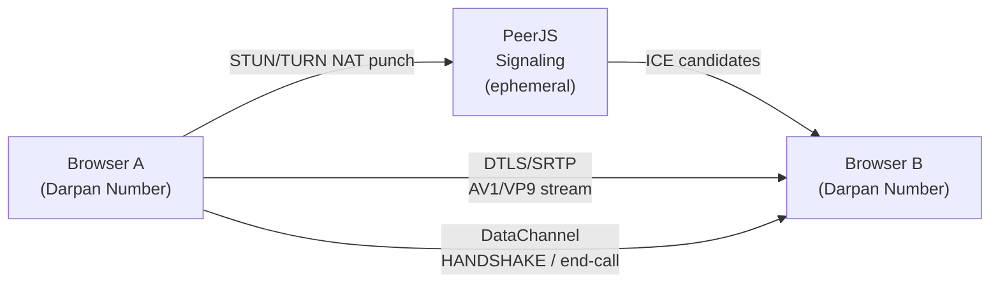

# Darpan

> **A purely peer-to-peer, zero-infrastructure WebRTC video calling engine.**

[](https://sagnikrout.github.io/Video_Call/)
[](https://github.com/sagnikrout/Video_Call)
[](https://www.typescriptlang.org/)
[](https://webrtc.org/)

---

## What It Is

Darpan is a browser-native, two-person video call engine with no servers, no accounts, no data retention. Two people exchange their **Darpan Numbers** — permanent 20-character Base36 identifiers — and call each other directly over an encrypted DTLS/SRTP tunnel. Once the peer connection is established, all audio and video travel exclusively between the two browsers. Nothing passes through any intermediary.

**Live:** [https://sagnikrout.github.io/Video_Call/](https://sagnikrout.github.io/Video_Call/)  
**Source:** [https://github.com/sagnikrout/Video_Call](https://github.com/sagnikrout/Video_Call)

---

## Darpan Number — Cryptographic Identity

Every session is assigned a **permanent Darpan Number**: a 20-character Base36 string (digits `0-9` and letters `A-Z`, case-insensitive), displayed in groups of four:

```
7KM2-X4PQ-3RTW-B1YZ-9ACD
```

### Why Base36 at 20 Characters?

The identifier space is $36^{20} \approx 1.33 \times 10^{31}$.

By the **Birthday Paradox**, the probability that any two of the $N \approx 10^{10}$ humans on Earth share a Darpan Number is:

$$P \approx \frac{N^2}{2 \cdot 36^{20}} \approx \frac{(10^{10})^2}{2 \times 1.33 \times 10^{31}} \approx 3.8 \times 10^{-12}$$

That is roughly **1 in 260 billion** — even if every person on Earth used the app simultaneously. The identifier is generated using `crypto.getRandomValues()` — no Math.random(), no timestamp entropy, no seeding.

Behind the Darpan Number, each individual call session also carries a **one-time ephemeral UUID** (`crypto.randomUUID()`) that is exchanged during the DTLS handshake via a companion DataConnection. This nonce governs session binding and is discarded when the call ends. The Darpan Number itself is your persistent address; the nonce is the envelope it was delivered in.

---

## Surreal Monochrom Engine (WebGL)

The video renderer is a custom WebGL fragment shader running inside a `<canvas>` element. It is entirely monochromatic — no chroma, no color — and processes each frame through a multi-stage pipeline:

1. **Temporal smoothing** — ping-pong texture accumulation between the current and previous frame to reduce flicker without introducing ghosting.
2. **Filmic S-curve** — a soft luminance curve that lifts the toe and rolls off the shoulder, matching the response of photochemical film stock.
3. **Halation bloom** — a simulated red-channel bloom at highlight edges, mimicking the light-scatter of a film base behind the emulsion.
4. **8-neighbor deconvolution** — a sharpening kernel that samples 8 surrounding texels and subtracts a fraction of the blurred signal from the center, recovering edge detail lost in compression.
5. **35mm grain** — a procedurally generated, luminance-dependent film grain layer using a hash function seeded by `u_time` and fragment coordinates. Grain amplitude scales with mid-tone luminance, falls in shadows, and fades in highlights — matching the behavior of real silver-halide grain.

The shader runs at native resolution with no downsampling. Uniform `u_scale` controls display fill; `u_resolution` governs the grain coordinate system.

---

## √2 : 1 Sensor Geometry

The sensor resolution is fixed at **1528 × 1080 px** across all quality presets.

$$\frac{1528}{1080} = 1.41481... \approx \sqrt{2} = 1.41421...$$

This is the diagonal-to-width ratio of an ISO 216 (A-series) rectangle, and the aspect ratio of the Super-35 film gate at full-aperture. It represents approximately **94.3% physical silicon harvest** — meaning for a given sensor diagonal, this ratio maximizes usable area while remaining compatible with standard 1080p display pipelines.

The viewport CSS stage enforces the ratio at any window size:

```css
width:  min(100vw, calc(100vh * 1.41421356));
height: min(100vh, calc(100vw / 1.41421356));
aspect-ratio: 1.41421356 / 1;
inset: 0;
margin: auto;
```

This guarantees the video stage never distorts, never letterboxes asymmetrically, and never overflows the viewport — regardless of display dimensions or orientation.

---

## Auto-Talk Audio Engine

Microphone audio passes through a Web Audio API chain before transmission:

| Stage | Type | Parameters |
|---|---|---|
| High-pass filter | `BiquadFilterNode` | Cutoff: 80 Hz, removes room rumble |
| Presence EQ | `BiquadFilterNode` (peaking) | Center: 3.2 kHz, +2.2 dB, Q = 1.8 |
| Compressor | `DynamicsCompressorNode` | Threshold: −24 dB, Ratio: 4:1, Attack: 3 ms, Release: 250 ms |
| Analyser | `AnalyserNode` | FFT: 256 bins, drives speaking-aura animation |

The chain auto-levels whispers and loud speech to a consistent perceived loudness, enhances vocal intelligibility in the 2–4 kHz presence band, and drives the real-time speaking-aura pulse on the video border.

---

## Codec Priority

The SDP offer is rewritten before negotiation to prefer:

1. **AV1** — highest quality per bit, royalty-free
2. **VP9** — fallback for browsers without AV1 hardware decode

H.264 and VP8 are stripped entirely from the SDP. There is no fallback to legacy codecs.

---

## Architecture



- **Signaling**: PeerJS cloud (used only for ICE candidate exchange; no A/V traversal)
- **Media**: Direct DTLS/SRTP tunnel after ICE negotiation
- **Exclusivity**: A third browser attempting to call either peer while a session is active receives an immediate `BUSY_REJECT` over the DataChannel and is dropped

---

## Quality Presets

All presets capture at the √2:1 sensor geometry. Frame rate and bitrate vary:

| Preset | Resolution | Frame Rate | Video Bitrate | Audio Bitrate |
|---|---|---|---|---|
| **High** | 1528 × 1080 | 60 fps | 6.0 Mbps | 256 kbps |
| **Medium** | 1528 × 1080 | 30 fps | 4.5 Mbps | 128 kbps |
| **Low** | 1528 × 1080 | 24 fps | 1.5 Mbps | 96 kbps |

The 30 fps floor is strict — `Medium` and `High` are hardware-enforced minimums. Quality can be switched live without terminating the call via `RTCRtpSender.setParameters()`.

---

## Setup

**Requirements:** Node.js ≥ 18, a Chromium-based browser.

```bash
# Install dependencies
npm install

# Install Playwright browsers (first time only)
npx playwright install chromium

# Build TypeScript
npm run build

# Run all tests
npm test
```

There is no bundler. TypeScript compiles directly via `tsc` to `dist/app.js`. Open `index.html` or serve with:

```bash
npx serve .
```

---

## Test Suite

8 Playwright tests run serially against a local Chromium instance with a fake camera and microphone:

| # | Test |
|---|---|
| 1 | Signaling handshake and call establishment |
| 2 | Error handling — invalid peer ID |
| 3 | Device enumeration |
| 4 | Microphone toggle (mute/unmute) |
| 5 | Camera toggle (pause/resume) |
| 6 | Live quality preset switching |
| 7 | Permanent Darpan Number persistence across page reloads |
| 8 | Strict 2-person call exclusivity — third-party busy rejection |

Run with: `npm test`

---

## License

ISC
